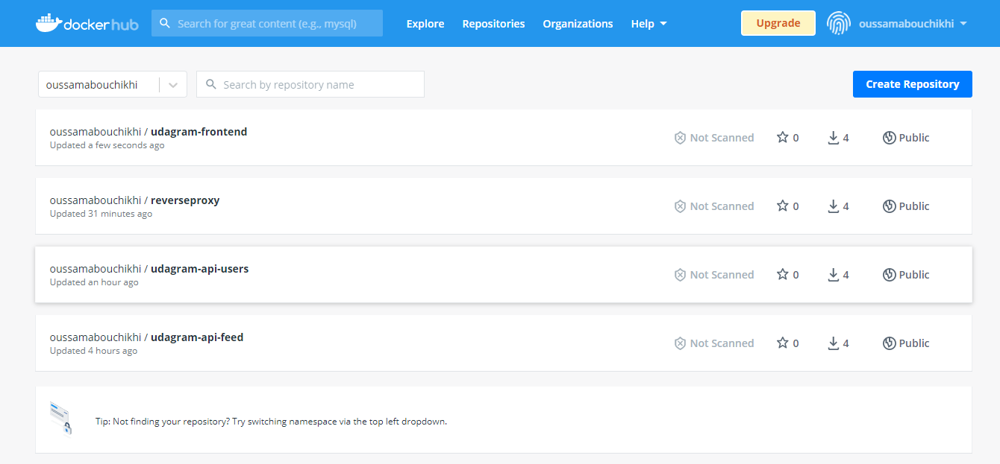
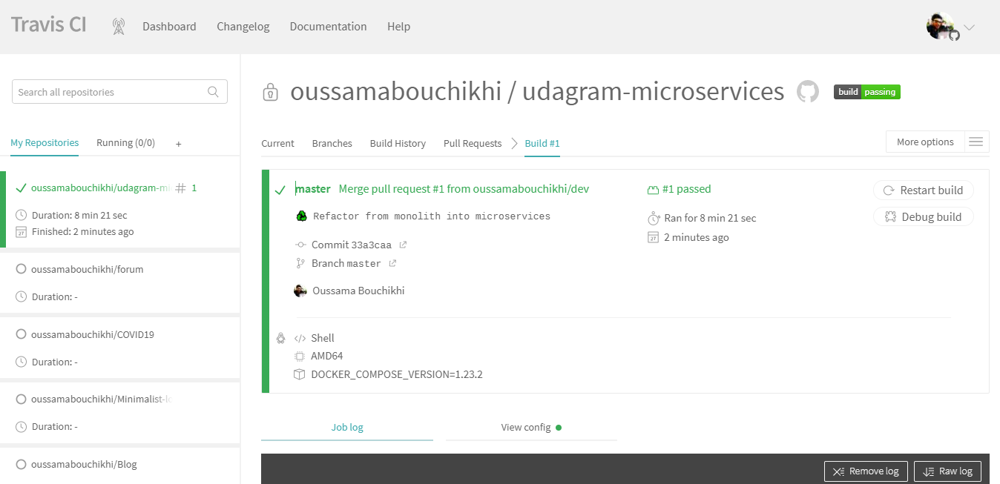
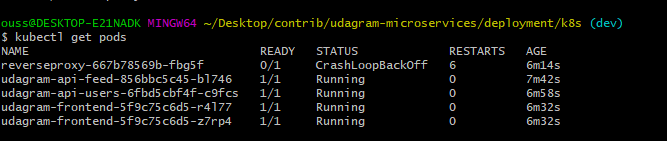
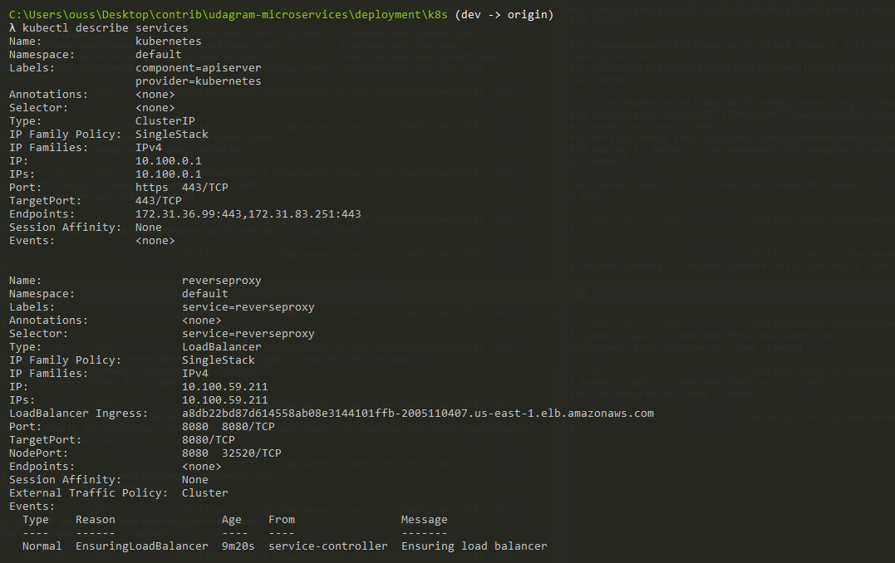
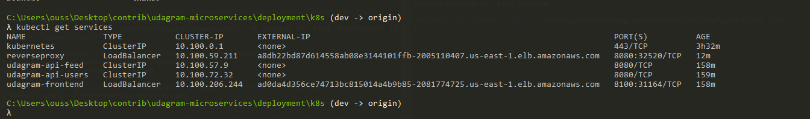
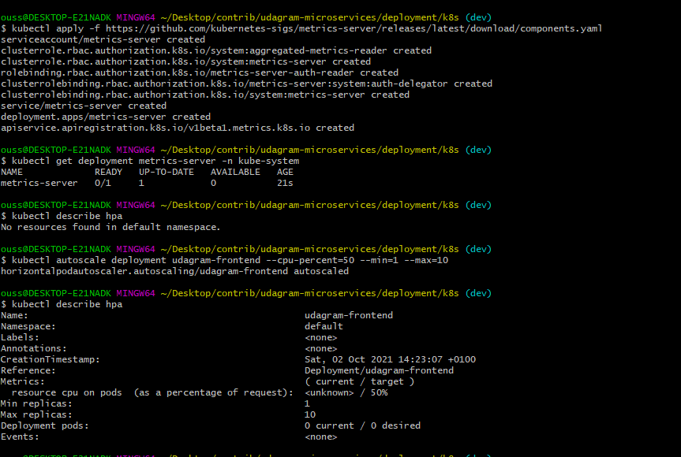
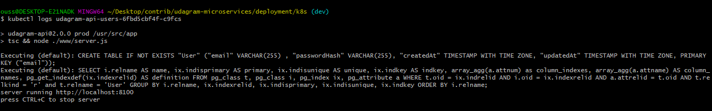

# Screenshots

To help review your infrastructure, please include the following screenshots in this directory::

## Deployment Pipeline

- DockerHub showing containers that you have pushed



- GitHub repository’s settings showing your Travis webhook (can be found in Settings - Webhook)
- Travis CI showing a successful build and deploy job



## Kubernetes

- To verify Kubernetes pods are deployed properly

```bash
kubectl get pods
```



- To verify Kubernetes services are properly set up

```bash
kubectl describe services
```





- To verify that you have horizontal scaling set against CPU usage

```bash
kubectl describe hpa
```



- To verify that you have set up logging with a backend application

```bash
kubectl logs {pod_name}
```



```bash
# udagram-microservices\deployment\k8s
kubectl  apply -f backend-feed-deployment.yaml
kubectl  apply -f backend-feed-service.yaml

kubectl  apply -f backend-user-deployment.yaml
kubectl  apply -f backend-user-service.yaml

kubectl  apply -f frontend-deployment.yaml
kubectl  apply -f frontend-service.yaml

kubectl  apply -f reverseproxy_deployment.yaml
kubectl  apply -f reverseproxy_service.yaml

```

### Docker

```bash
# udagram-microservices\udagram-frontend
docker build -t udagram-frontend .
docker tag udagram-frontend oussamabouchikhi/udagram-frontend
docker push oussamabouchikhi/udagram-frontend

# udagram-microservices\udagram-api-users
docker build -t udagram-api-users .
docker tag udagram-api-users oussamabouchikhi/udagram-api-users
docker push oussamabouchikhi/udagram-api-users

# udagram-microservices\udagram-api-feed
docker build -t udagram-api-feed .
docker tag udagram-api-feed oussamabouchikhi/udagram-api-feed
docker push oussamabouchikhi/udagram-api-feed

# Other usefull commands
docker images
```

Or alternatively, build & run all images at once using docker compose

```bash
# Make sure the Docker services are running in your local machine
# Remove unused and dangling images
docker image prune --all

## deployment/docker
*# Run this command from the directory where you have the "docker-compose-build.yaml" file present*
docker-compose -f docker-compose-build.yaml build --parallel

# Run app
docker-compose up
```
